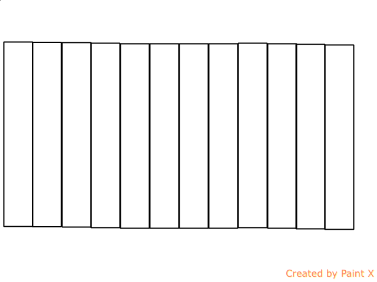
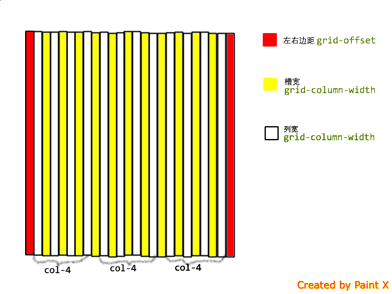

### 备注
试试less之前没用过的东西就想到写这么个玩意了。
开始的时候想不通栅格是怎么算出来的，所以由简到难，demo1只有12个栅格；

##### demo1原理图片示例

#### demo2原理图片示例

demo2中混合了两边距及槽宽，参考了项目中的栅格思想，因为米折的产品中栅格基本被用于展示商品，最常见的是商品双列和商品三列，所以demo2中引入了槽宽和边距的概念,这个更像是定制的模块。  

#### demo3、demo4
demo1、demo2用rem做单位，其实是按照最大的容器默认大小是16rem计算的，如果外层容器不满足16rem的宽度，等于这个css文件是没用的。

所以demo3、demo4只是改用了百分比的方案实现栅格，这样无论外层容器大小是多少，通用性就比较强了。

### 运行
npm install  
gulp